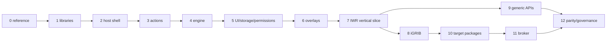

# Incremental migration plan

## Smallest decisive vertical slice

Use **iWeatherRouting in a deliberately reduced demonstration mode**, not
iGRIB, as the first end-to-end slice. It exercises the architectural seams
(navigation snapshot, action, declarative UI, overlay, job/cancellation and
settings) without making native GRIB helper packaging and credentials a
prerequisite.

Acceptance on an unmodified stock executable:

1. managed native host loads and discovers one signed package;
2. package has its own stable `open-main-window` toolbar action;
3. click opens host-rendered declarative UI;
4. a timestamped public-API navigation snapshot reaches the component;
5. one retained scene renders in software and GL;
6. one bounded route job reports progress and cancels on package disable;
7. one setting survives OpenCPN restart;
8. package disable removes its action/scene/UI and leaves the host usable;
9. enable restores the same logical action without relying on the old integer;
10. the slice uses no private OpenCPN headers and no modified executable.

This slice proves more architecture per dependency than iGRIB. iGRIB follows
once helper supervision, environmental cache and network permissions are
packaged. The modified-core proof stays buildable as the behavioural oracle
until both packages reach parity.

## Phase plan

### 0 — Freeze and characterise the reference

- **Deliverable:** pinned stock/reference SHAs, service/core inventory,
  package/runtime test baseline and known-defect list.
- **Affected code:** documentation and tests only.
- **Dependencies:** none.
- **Tests:** current bridge/package/UI/routing tests; reproducible reference
  build; record platform/tool versions.
- **Acceptance:** every meaningful core modification has an owner/destination.
- **Rollback:** documentation-only commit.
- **Risk:** concurrent prototype changes contaminate evidence; mitigate with
  commit archives, as this study did.
- **Demo:** capability/core-change report.

### 1 — Extract runtime-independent libraries

- **Deliverable:** bridge C ABI, WIT, package validation, SemVer, polar parser
  and retained value models build without OpenCPN GUI/core targets.
- **Affected code:** `portable-runtime`, pure portable utilities.
- **Dependencies:** Phase 0 fixtures.
- **Tests:** offline Cargo build, bridge smoke for both components, package
  negative corpus, pure C++ unit tests, sanitizer jobs where supported.
- **Acceptance:** no OpenCPN/wx header in engine/package core; identical WIT
  artifacts and passing reference tests.
- **Rollback:** retain existing linked copies behind current flag.
- **Risk:** accidental ABI drift; pin generated bindings and golden metadata.
- **Demo:** standalone lifecycle of both components.

### 2 — Create the conventional host shell

- **Deliverable:** template-based managed plugin with `Init`/`DeInit`, config,
  read-only installed-data path and writable host-private root.
- **Affected code:** new host-plugin project only.
- **Dependencies:** supported API 1.21 and target template.
- **Tests:** stock load/enable/disable/re-enable/shutdown, missing/corrupt state,
  ABI/package smoke on Linux.
- **Acceptance:** no private headers/symbols; clean bounded shutdown.
- **Rollback:** plugin is isolated and not in normal catalogue.
- **Risk:** global/static lifetime during unload.
- **Demo:** runtime manager dialog/action on stock OpenCPN.

### 3 — Land the action registry and package toolbar proof

- **Deliverable:** production-shaped `(package_id, action_id)` registry,
  validated icons and UI-thread adapter based on P1.
- **Affected code:** host action module and action-manifest schema.
- **Dependencies:** Phase 2.
- **Tests:** duplicate IDs, multiple actions, late add/remove, check state,
  rebuild, restart, trap, disable, update and shutdown; theme/DPI/touch target
  visual matrix.
- **Acceptance:** manager+iGRIB+iWeatherRouting actions independently route and
  clean up on stock core; no raw native ID crosses the registry.
- **Rollback:** one host icon plus package menu if a target exposes a toolbar
  defect.
- **Risk:** current rebuild workaround changes upstream.
- **Demo:** three live child icons without component execution.

### 4 — Embed the engine and complete lifecycle scheduling

- **Deliverable:** private bridge library, lazy engine, serial per-component
  executor, generation tokens, mandatory limits and deterministic shutdown.
- **Affected code:** host engine adapter; bridge only for generic fixes.
- **Dependencies:** Phases 1–3.
- **Tests:** P2 promoted to integration test; both packages; trap, fuel, epoch,
  OOM limit, identity mismatch, update during queued click and repeated unload.
- **Acceptance:** no guest call blocks UI/render; all stores/threads end before
  `DeInit` returns.
- **Rollback:** host manager/actions run with component activation disabled.
- **Risk:** `panic=abort` and native dependency collisions; initially restrict
  packages to project-signed previews and keep broker seam explicit.
- **Demo:** minimal signed component opens a host-owned surface from its icon.

### 5 — Port declarative UI, storage and permission consent

- **Deliverable:** versioned bounded UI schema, settings/storage namespaces,
  scoped import/export and permission state machine.
- **Affected code:** extract `portable_ui_menu`, relevant manager/UI portions,
  package manifest.
- **Dependencies:** Phase 4 lifecycle.
- **Tests:** malformed/deep/large UI and icons, translation fallback,
  accessibility inspection, permission add/remove/update, traversal/quota and
  atomic setting recovery.
- **Acceptance:** untrusted values never become paths/pointers unchecked;
  permission update fails closed.
- **Rollback:** minimum host-owned fixed dialog for unsupported schema.
- **Risk:** UI schema becomes a second widget toolkit; keep it semantic and
  small.
- **Demo:** iWeatherRouting window and persisted setting.

### 6 — Port retained overlays and semantic input

- **Deliverable:** immutable validated scene snapshots, DC/GL adapters,
  multiple-canvas semantics and host hit testing.
- **Affected code:** extract retained commands from manager/routing/environment
  hosts; new renderer module.
- **Dependencies:** Phase 5 value model.
- **Tests:** P3 promoted; clipping, large/invalid scenes, concurrent publish,
  disable/update, DPI, canvas focus/index, software/GL parity and refresh.
- **Acceptance:** render callbacks make no guest/IPC call and meet a measured
  frame budget.
- **Rollback:** suppress failed package scene without affecting other children.
- **Risk:** GL state leakage; scoped state tests on every supported renderer.
- **Demo:** independent child overlays with one disabled live.

### 7 — Port navigation and iWeatherRouting job slice

- **Deliverable:** timestamped navigation values, public route/waypoint reads,
  confirmation-gated mutations and bounded job/cancellation scheduler.
- **Affected code:** extract routing host logic and public adapter; no chart
  private headers.
- **Dependencies:** Phases 4–6.
- **Tests:** P4/P5 promoted; stale revisions, route size/invalid coordinates,
  user cancel, disable/update/shutdown, multi-canvas cursor and route rollback.
- **Acceptance:** the full vertical-slice checklist passes on stock OpenCPN.
- **Rollback:** export GPX only; disable direct route mutation.
- **Risk:** current chart service name implies more safety than delivered;
  rename/reduce it before release.
- **Demo:** first architecture-decision milestone.

### 8 — Port environmental broker and iGRIB

- **Deliverable:** decomposed provider/cache/viewer, constrained HTTP, signed
  target helpers and iGRIB package parity.
- **Affected code:** extract `PortableEnvironmentHost`, helper protocols,
  package resources and network/storage broker.
- **Dependencies:** permissions, overlays, jobs and helper packaging.
- **Tests:** real GRIB fixtures, corrupted/oversized inputs, cache budgets,
  provider version mismatch, credentials redaction, helper timeout/tree kill,
  offline/proxy/TLS, Flatpak portal/sandbox.
- **Acceptance:** iGRIB action, viewer, generation/decoding and cleanup work
  without core changes; no safety claim.
- **Rollback:** local-file-only mode or disable native helper capability per
  target.
- **Risk:** helper/library footprint and unequal containment.
- **Demo:** both reference packages under one native host.

### 9 — Residual dependency audit and generic API proposals

- **Deliverable:** zero private API dependencies; measured toolbar limitations;
  independently reviewable generic action proposal; conditional chart/credential
  proposals.
- **Affected code:** public API patch branches separate from host migration.
- **Dependencies:** behavioural parity evidence.
- **Tests:** upstream API contract suite proposed in
  `MINIMAL-OPENCPN-CHANGES.md` plus host fallback tests.
- **Acceptance:** host continues to build with proposal absent; no runtime-named
  API.
- **Rollback:** documented stock fallbacks.
- **Risk:** maintainer rejection; do not block preview on it.
- **Demo:** beta UX comparison with/without extended API.

### 10 — Managed packaging and desktop target gates

- **Deliverable:** host tarballs/metadata for Linux x86-64/ARM64, Flatpak,
  Windows x86-64 and both macOS architectures; SBOM and runtime vulnerability
  response policy.
- **Affected code:** template CI, target manifests, helper/runtime packaging.
- **Dependencies:** Phases 7–9.
- **Tests:** install/update/uninstall, ABI target IDs, read-only data root,
  helper discovery, signatures, offline rollback, notarisation/codesigning and
  stock release matrix.
- **Acceptance:** each advertised target has executed conformance; missing
  target is absent from metadata rather than inferred.
- **Rollback:** publish no catalogue entry; retain imported beta tarballs.
- **Risk:** Wasmtime/helper cadence outpaces host release cadence.
- **Demo:** private beta catalogue/import packages.

### 11 — Broker security boundary

- **Deliverable:** authenticated/versioned local IPC, broker restart/quarantine,
  scene/job value protocol and process resource limits.
- **Affected code:** split engine/package/helper modules; small adapter remains.
- **Dependencies:** stable measured in-process semantics.
- **Tests:** malformed/truncated/oversized IPC, replay/stale generation, broker
  crash/hang/OOM, restart, OpenCPN exit, latency/frame budget and downgrade.
- **Acceptance:** killing/aborting the broker does not crash OpenCPN; all child
  contributions retract and can recover.
- **Rollback:** project-signed packages may use audited in-process mode; third-
  party packages remain disabled.
- **Risk:** IPC complexity and platform spawning.
- **Demo:** deliberate broker abort with live host recovery.

### 12 — Parity, deprecation and governance decision

- **Deliverable:** side-by-side parity report, removed-core patch list, trust/
  catalogue ownership and decision on first-class manager integration.
- **Affected code:** only now delete redundant modified-core runtime wiring.
- **Dependencies:** target gates and security posture accepted.
- **Tests:** golden package workflows on reference and stock host; migration of
  settings/packages; downgrade/rollback; long soak and support bundle.
- **Acceptance:** no required reference behaviour is silently lost, all reduced
  services are named honestly, and an owner/security SLA exists.
- **Rollback:** retain the pinned reference branch; never rewrite its history.
- **Risk:** ecosystem governance has no maintainer.
- **Demo:** release-candidate architecture decision.

## Dependency order

Production implementation begins only after Phase 7 demonstrates the stock-
executable slice. Phases remain independently revertible and must never absorb
unrelated ongoing iWeatherRouting work.
