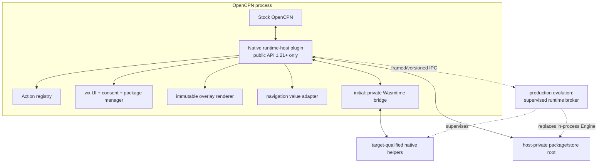
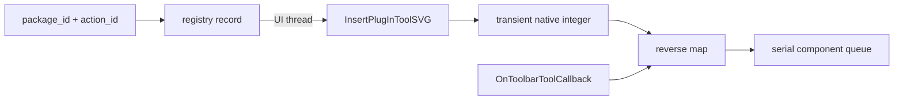
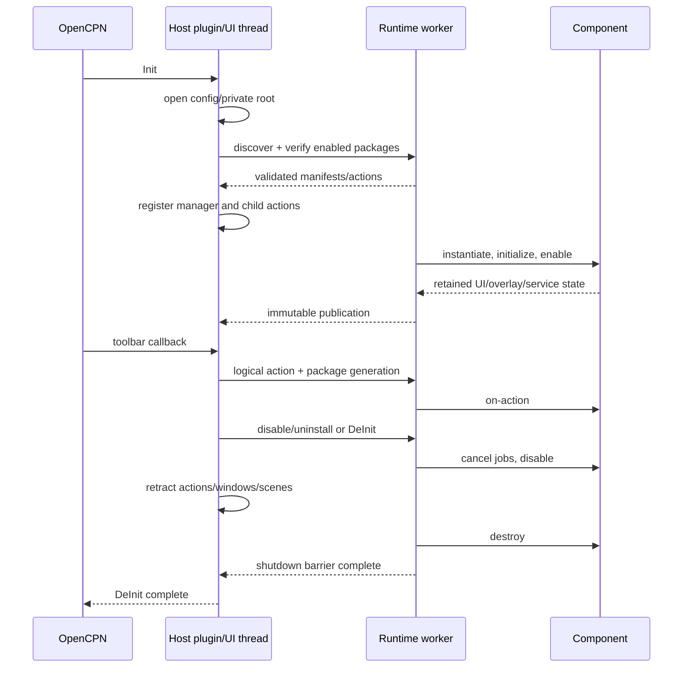

# Recommended runtime-host architecture

## Architecture

Use a conventional managed OpenCPN plugin as the only native OpenCPN plugin.
For the first vertical slice, link the existing Rust bridge privately into that
module. Keep the adapter/process interface explicit so the runtime engine and
untrusted package execution can move into a supervised broker before a public
third-party ecosystem is enabled.



The in-process adapter always remains necessary: toolbar callbacks, wx windows
and DC/GL rendering are OpenCPN-process operations. The broker boundary moves
component execution, package parsing, high-risk native decoders and resource
accounting; it must never transport native callback pointers, wx objects or
raw toolbar IDs.

## Module boundaries

| Module | Responsibility and hard boundary |
|---|---|
| OpenCPN adapter | Lifecycle/capability flags, position/cursor/input callbacks, route value APIs, refresh, config/data paths and messages; only module including `ocpn_plugin.h` |
| Runtime engine | Compile/cache/instantiate components, fuel/epoch/memory limits, trap conversion and WIT value calls |
| Package manager | Discover, verify, stage, atomically activate, rollback, quarantine and remove packages below a host-private root |
| Trust policy | Production roots, signer/package scope, expiry/rotation, target assertions and revocation |
| Permission broker | Requested/effective grants, update deltas, prompts, scoped file handles and audit events |
| Action registry | Stable logical keys, icon validation, native ID mapping, dispatch state and teardown |
| Declarative UI | Versioned bounded model to native wx controls; no guest widget/pointer access |
| Overlay service | Validated retained commands, immutable snapshots, DC/GL consumers and semantic hit testing |
| Job scheduler | Worker queues, progress snapshots, deadlines, cooperative cancellation and shutdown barrier |
| Navigation service | Timestamped immutable vessel/route/waypoint values and user-confirmed mutations |
| Environmental service | Provider registry, byte-bounded cache, sampling batches and source attribution |
| Helper supervisor | Signed target selection, framed I/O, deadlines, process-tree termination and platform containment |
| Storage/network | Canonical package-relative paths, quotas, atomic writes, scoped imports and constrained HTTP |
| Diagnostics/update | Attributed logs, health state, support bundle, runtime/package versions and rollback UI |

Large existing classes such as `PortableEnvironmentHost` and
`PortableWeatherRoutingHost` are extraction sources, not target module
boundaries.

## Toolbar action registry

The canonical key is the tuple `(canonical package_id, action_id)`. A portable
component never sees the OpenCPN integer. The registry record contains:

```text
logical key, manifest version, label/tooltip translation keys,
kind, validated icon set, order hint, requested visibility,
checked, enabled/dispatchable, package generation, current native ID
```

Registration occurs in two stages. A worker validates the signed manifest,
normalises archive-relative icon paths, bounds encoded and decoded size,
decodes SVG/raster into a safe host representation, and resolves translations.
The UI thread then inserts the tool and atomically installs both forward and
reverse maps. A duplicate logical key fails before insertion; a duplicate
native ID retracts the just-created tool and quarantines the activation.

Current API 1.21 mapping:



Rules and failures:

- Static manifest actions are preferred; dynamic guest requests pass the same
  policy and never bypass manifest limits.
- An initialising package may be hidden. API 1.21 cannot show a natively
  disabled tool, so preview code must block dispatch or substitute artwork.
- A click first checks package generation, effective permission, enabled state
  and whether the component queue accepts work. It never invokes long guest
  work synchronously on the UI thread.
- A trap marks the generation unhealthy, blocks dispatch, retracts its tools,
  cancels jobs and publishes diagnostics. Recovery creates new native IDs.
- Invalid/missing icons fall back to a host-owned neutral icon only when policy
  permits; executable SVG/resource references, traversal, excessive dimensions
  and decompression bombs are rejected.
- Update preserves a tool only when both IDs are unchanged. Removed actions
  become bounded host preference tombstones. Renamed actions are delete+add.
- Identical labels are harmless; logical keys, not labels, determine routing.
- Runtime disable/uninstall removes actions before instance destruction.
- Shutdown stops new callbacks, cancels work, removes tools on the UI thread,
  then destroys components and engine state.

Suggested manifest addition:

```json
{
  "actions": [{
    "id": "open-main-window",
    "label_key": "action.open-main-window.label",
    "tooltip_key": "action.open-main-window.tooltip",
    "kind": "command",
    "toolbar": {
      "visible_by_default": true,
      "normal_icon": "icons/weather-routing.svg",
      "rollover_icon": "icons/weather-routing-rollover.svg",
      "toggled_icon": "icons/weather-routing-toggled.svg",
      "order_hint": 40
    }
  }]
}
```

Unknown manifest fields follow the package-format compatibility policy;
unknown required action kinds fail closed. `order_hint` is advisory because
stock OpenCPN does not persist child placement.

## Lifecycle and shutdown



`Init` must not compile every component synchronously. It opens state, creates
the runtime manager action and schedules discovery. Validated static actions
can be inserted as disabled-by-policy/hidden placeholders; activation publishes
dispatchability only after successful enable.

Shutdown ordering is fixed: reject new child calls; stop timers and input;
cancel jobs/network; terminate helpers; remove UI contributions; disable and
destroy component generations; release broker/engine; flush bounded atomic
state. No detached worker may outlive `DeInit`.

## Threading model

| Context | Permitted work |
|---|---|
| OpenCPN UI thread | Toolbar/context action registration/state/removal, wx windows, config adapter calls requiring UI ownership, callback enqueueing |
| Render callbacks | Read one immutable prepared scene; coordinate transform and bounded DC/GL draw only; no guest/IPC/network call |
| Runtime serial executor per component generation | Lifecycle and ordinary WIT calls, preserving store ownership and ordered action semantics |
| Job worker pool | Bounded compute on independent runtime/store replicas, environmental sampling and validated file transforms |
| Helper I/O threads | Framed nonblocking pipes, byte limits, cancellation and process status |
| Package worker | Download, verify, extract to staging and prepare update; activation handoff is serialised |

Workers publish values through generation-tagged queues. UI callbacks use weak
generation tokens; late results are discarded after disable/update. Broker IPC
must implement request IDs, bounded frame lengths, deadlines, cancellation and
protocol negotiation.

## Child package model and user presentation

Install children below a runtime-owned writable root, for example
`<OpenCPN-private>/portable-runtime/packages/<package-id>/`, with separate
staging, rollback, cache, settings and logs. The native managed plugin's
installer-owned data directory is read-only and contains the host runtime,
default trust metadata and target helpers; it is never mutated by child update.

Users see:

- one **Portable Runtime Host** entry in OpenCPN Plugin Manager;
- separate runtime manager, iGRIB and iWeatherRouting toolbar icons;
- child package names, versions, permissions, updates, health, rollback and
  settings inside the runtime manager;
- attributed errors such as “iWeatherRouting trapped; action removed”.

Call children **portable packages** or **child extensions**, not standard
OpenCPN plugins. Separate toolbar presence is genuine; separate native manager
identity is absent.

## Compatibility contracts

- Native host advertises and tests an OpenCPN API interval (initially 1.21).
- Runtime host version controls package-format and action-manifest versions.
- Every WIT world/service is independently semantically versioned; a package
  declares ranges and required/optional features.
- Package version is immutable for a signed archive; update generation is a
  host runtime value and invalidates stale callbacks.
- Native helper targets include OS, architecture, ABI and helper protocol; the
  package signature covers payload and declaration.
- Broker protocol versions independently from WIT so broker and adapter can be
  upgraded with an explicit compatible interval.

## Packaging by platform

| Target | Plan |
|---|---|
| Linux x86-64 | First supported native target; private bridge or broker, target helper, hidden symbols and rpath/loader audit |
| Linux ARM64 | Same architecture after native CI and runtime/helper conformance |
| Flatpak x86-64/ARM64 | Managed tarball inside the app sandbox; test portals, network policy, executable helper paths and whether additional nested bwrap is available; never assume it |
| Windows x86-64 | Private DLL/static bridge, MSVC-compatible plugin ABI, Job Object helper containment and signed binaries |
| macOS Intel/Apple Silicon | Separate or universal managed artifacts, hardened-runtime/JIT entitlement validation, helper signing and notarisation |
| Android | Deferred. No initial managed package claim; investigate arm64 interpreter/AOT and mobile lifecycle separately only after desktop beta |

The measured Linux release bridge archive was 40 MiB and the linked probe
module 22 MiB. Production builds should test feature reduction and a private
shared/broker executable, but size optimisation must not remove fuel, epoch,
component-model or security diagnostics without an explicit trade study.
