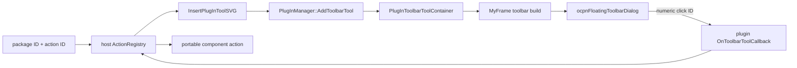

# Toolbar and child-action feasibility

## Conclusion

**Separate package-specific icons are feasible on stock OpenCPN 5.14.0.** One
ordinary native plugin can register the runtime manager, iGRIB,
iWeatherRouting and additional child actions as distinct left-hand toolbar
tools. They can have separate SVGs, tooltips, toggle states and click routing.
Public APIs can also remove and re-register them without restarting OpenCPN.

The result is not equivalent to first-class plugins. OpenCPN owns all numeric
tools on behalf of the outer host plugin, exposes no persistent child-action
identity, and lists only the host in Plugin Manager. API 1.21 also lacks a
per-tool enabled/disabled operation. Dynamic insertion works, but only because
the host follows `InsertPlugInToolSVG` with the visibility setter to request a
toolbar rebuild; insertion itself does not request one. That workaround is
adequate for a technology preview, but a small generic action API is justified
for a broadly usable beta.

## Sources and public surface

The findings were checked against stock tag `Release_5.14.0` at
`91f3b674366068a6ecd61a5e9aba204bba85f57e`, the study base, and upstream
`master` at `bc0e1ededbb10cd44feffc26b7989b6b990fa6eb`. All expose API 1.21
and the same relevant calls in `include/ocpn_plugin.h`:

- `InsertPlugInTool` and `InsertPlugInToolSVG`;
- `RemovePlugInTool`;
- `SetToolbarToolViz`;
- `SetToolbarItemState`;
- `SetToolbarToolBitmaps` and `SetToolbarToolBitmapsSVG`;
- `OnToolbarToolCallback(int)` on the plugin object.

There is no public `SetToolbarToolEnabled`, stable string action ID,
placement/persistence hook, or toolbar-rebuilt notification.

## Call path and ownership



`gui/src/ocpn_plugin_gui.cpp` forwards the public calls to
`PlugInManager`. `PlugInManager::AddToolbarTool` appends a container and assigns
`m_plugin_tool_id_next++`. During toolbar construction,
`MyFrame::CheckAndAddPlugInTool` and `AddDefaultPositionPlugInTools` copy its
SVG paths, item kind, tooltip and ID into a toolbar item marked as plugin-owned.
Click dispatch looks up the numeric ID and calls the owning plugin's callback.

The integer is process-local allocation state, not package identity. The host
must keep a reverse map and portable code must never receive it.

## Required acceptance questions

| Question | Finding | Evidence / qualification |
|---|---|---|
| Multiple tools from one plugin | Yes | OCPN Draw registers two public SVG tools with one owner; the stock probe registers three logical child actions |
| Distinct icon, tooltip and label | Yes | Each insertion stores separate fields; probe used three separate SVG files and tooltip strings |
| Independent checked state | Yes, for check tools | `wxITEM_CHECK` plus `SetToolbarItemState`; probe changed iGRIB without changing other registry state |
| Independent enabled state | No native public control | Host can block dispatch, hide the tool, or replace artwork, but cannot set the toolbar's native disabled state |
| Add after `Init()` | Yes, with caveat | Stock probe added iWeatherRouting from a UI-thread timer after startup |
| Remove without restart | Yes | `RemovePlugInTool` removes the container and requests a rebuild; probe removed iGRIB and trapped iWeatherRouting |
| Add without restart | Yes, workaround required | `AddToolbarTool` does not request a rebuild. Probe calls `SetToolbarToolViz(new_id, true)`, whose implementation requests one |
| Package failure cleanup | Yes if host acts | Host must remove or hide actions immediately. Current modified-core `Fail` path should be tightened because it clears scenes but can leave actions registered |
| Multiple actions per package | Yes | Registry key includes action ID; no OpenCPN multiplicity limit was found |
| Reliable click routing | Yes | Numeric callback ID is owner-routed; registry resolves it to a unique logical key. Production OCPN Draw uses the same multi-ID dispatch model |
| Toolbar rebuild ID stability | Container ID survives a rebuild | Rebuild reconstructs UI items from containers using the stored ID. Removal/re-registration allocates a new ID |
| Restart ID stability | Not contractual | IDs are allocated again in load order. Observed values can repeat with identical order, but must be treated as transient |
| Update identity | Host-owned logical identity can persist | Preserve `package_id + action_id`; rebuild the numeric map after every registration. Renaming either logical part intentionally creates a new action |
| Visibility persistence | Host must own it | Plugin tools are skipped by `_toolbarConfigMenuUtil`, so stock toolbar customisation does not manage/persist them |
| Placement persistence | No child identity-based persistence | Position is a numeric insertion request. Default `-1` appends in registration order; the stock config persists built-in position flags, not package/action keys |
| Ordering | Suggestion only | Explicit numeric position or registration order can influence placement, but collisions, core tools and rebuilds prevent a durable ordering guarantee |
| Toolbar customisation | Plugin tools are not offered | `gui/src/toolbar.cpp::_toolbarConfigMenuUtil` returns immediately for `m_bPlugin` |
| SVG and raster | Both supported | Public SVG and bitmap insertion/update calls; OCPN Draw and ShipDriver exercise both |
| Day/dusk/night | Raster is dimmed by core; SVG is rendered by toolbar | `AddToolbarTool(bitmap)` builds dusk/night variants. SVG paths are attached to reconstructed toolbar tools. Package icons still require cross-scheme contrast validation |
| Selected/rollover | Supported | SVG API accepts normal, rollover and toggled paths; bitmap API accepts normal and rollover, with check state handled separately |
| Disabled artwork | No explicit SVG disabled variant API | A host can substitute SVGs, but this is not equivalent to native disabled state/accessibility |
| High DPI/touch/resize | Core scales the toolbar and reloads/rescales tool artwork | `GetToolbarScaleFactor`, toolbar-size rebuild paths and SVG loading apply to plugin tools. Probe ran on Linux at a 5.58 DPMM display; cross-platform visual validation remains open |
| Multiple canvases | Toolbar is application-global | An action can select a canvas in its dispatch semantics, but it does not get one icon per canvas. Overlay callbacks receive canvas indices in modern APIs |
| Accessibility/keyboard | Partial and not child-controllable enough | Independent tooltip/label strings are supplied. No public child action object exposes an accessibility name, accelerator or keyboard command binding |
| Translation | Host can translate labels/tooltips | Child catalog loading and locale negotiation must be a runtime facility; OpenCPN sees only the host's native catalogue identity |

## Prototype

The isolated conventional plugin lives at
`experiments/runtime-host-toolbar-plugin`. It includes a runtime-owned logical
registry, three SVG actions and an optional UI-thread lifecycle sequence. It
uses only `ocpn_plugin.h`; it is not linked to or compiled with private GUI or
plugin-manager headers.

It was loaded into an unmodified 5.14.0 source snapshot. The recorded sequence
was:

1. manager and iGRIB registered during `Init` as IDs 1574 and 1575;
2. iWeatherRouting registered after startup as ID 1576;
3. a duplicate iWeatherRouting key was rejected;
4. iGRIB alone was checked;
5. iGRIB was removed on simulated package disable;
6. the same logical iGRIB action was re-registered as transient ID 1577;
7. iWeatherRouting ID 1576 was removed on a simulated component trap;
8. it recovered under ID 1578;
9. callback ID 1578 resolved to and toggled only the recovered iWeatherRouting
   logical action;
10. iGRIB ID 1577 was rejected while its host dispatch gate was closed, then
    restored without changing identity;
11. plugin deinitialisation removed all three, leaving registry size zero.

The first run also proved an unrelated loader precondition: stock 5.14
dereferences `GetPlugInBitmap()` without a null check at
`model/src/plugin_loader.cpp:668`. The probe now returns an owned valid bitmap.

The desktop-compositor screenshot route returned a black capture, so the study
does not claim pixel-level theme validation from that artifact. Registration,
rebuild and cleanup are proven by the stock application's own call path and
timestamped logs; SVG contrast and target-specific rendering remain explicit
visual test work.

## Stable action registry design

The canonical key is `(package_id, action_id)`. Both are immutable,
case-sensitive manifest identifiers after canonical package validation. The
registry stores label/tooltip translation keys, icon variants, kind, desired
visibility, checked state, dispatch state and optional order hint. Its native
adapter stores the current integer ID and reverse map.

Rules:

- reject a duplicate key before calling OpenCPN;
- reject a duplicate returned native ID and remove the just-created tool;
- validate and decode untrusted icon assets before UI-thread registration;
- register/remove/state-change only on the OpenCPN UI thread;
- never persist or expose the numeric ID;
- remove actions before destroying a component instance;
- on a trap, atomically stop dispatch and remove or hide the action;
- preserve placement preferences only by logical key;
- if an update removes an action, delete its host preference after a bounded
  tombstone period, not by reusing its numeric ID;
- if an action ID changes, treat it as delete plus add.

Suggested manifest shape, integrated with the existing package manifest rather
than a separate executable registration protocol:

```yaml
actions:
  - id: open-main-window
    label_key: action.open-main-window.label
    tooltip_key: action.open-main-window.tooltip
    kind: command
    toolbar:
      visible_by_default: true
      normal_icon: icons/weather-routing.svg
      rollover_icon: icons/weather-routing-rollover.svg
      toggled_icon: icons/weather-routing-toggled.svg
      order_hint: 40
```

For dynamic actions discovered only after component execution, the component
may request registration through WIT, but the host must apply the same manifest
schema and validation. Static declarations are preferred because they can be
validated and presented before instantiation.

## Minimal generic API improvement

A beta-quality host should request one coherent dynamic toolbar action API,
not runtime-specific calls. A suitable shape is:

```cpp
PluginActionHandle RegisterToolbarAction(const PluginActionSpec& spec);
bool UpdateToolbarAction(PluginActionHandle, const PluginActionState& state);
bool UnregisterToolbarAction(PluginActionHandle);
```

`PluginActionSpec` should carry a plugin-owned stable UTF-8 key, labels,
theme/state icon sources, kind and order hint. `PluginActionState` should carry
visible, enabled and checked. OpenCPN should request the rebuild internally,
persist customisation by `(native_plugin_identity, stable_key)`, preserve
handles across toolbar rebuilds, document UI-thread ownership, and deliver
clicks by stable handle/key. This benefits any native plugin with dynamic data
sources or modes.

Fallback if rejected: use the proven insertion-plus-visibility rebuild
workaround, store all preferences in the host, hide while initialising, remove
on failure, and describe ordering/customisation/native-disable limitations in
the beta release notes.
