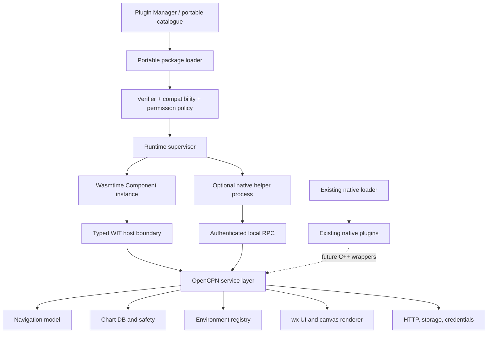
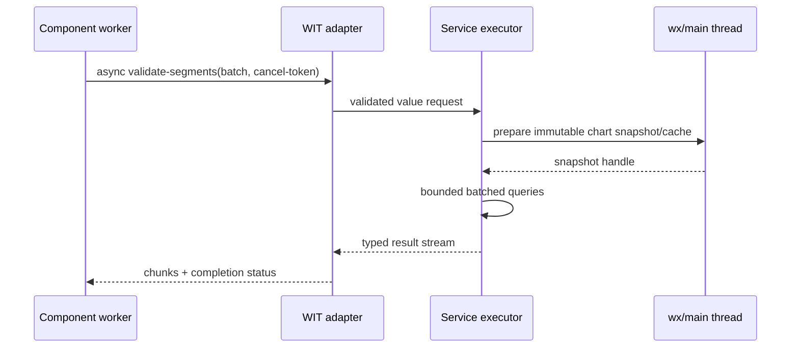

# RFC: Optional portable plugin runtime for OpenCPN

Status: **experimental implementation validated on Linux x86-64; not approved for production**

Scope: OpenCPN **5.14.0** (`Release_5.14.0`, commit `91f3b674366068a6ecd61a5e9aba204bba85f57e`)

Date: 2026-07-19

Implementation note: the research checkpoint was accepted for the isolated
Test-OpenCPN tree. The vertical slice and an expanded standalone iGRIB proof
are now implemented behind both experimental gates. See
[prototype-status.md](prototype-status.md) and
[conformance-linux-x86_64.md](conformance-linux-x86_64.md). The recommended
production architecture and unresolved cross-platform/governance gates below
remain proposals.

## Executive decision

A platform-neutral second plugin tier is technically feasible. The recommended design is a **hybrid capability platform**:

1. OpenCPN embeds Wasmtime and loads WebAssembly Components described by versioned WIT worlds.
2. A new OpenCPN service layer owns navigation, charts, environmental data, retained overlays, declarative UI, jobs, storage, HTTP, credentials, settings and typed service discovery.
3. Components receive only explicitly granted services. General WASI filesystem and socket access is not linked by default.
4. Specialist libraries which are impractical in Wasm run only in optional, signed, supervised native helper processes. Helpers are an exception, never a silent fallback.
5. The existing C++ loader and every native plugin continue unchanged.

Use **Wasmtime** for the prototype. Version 46.x is the first suitable baseline because it enables stable WASI 0.3 and Component Model async; select the newest patched 46.x at dependency intake. It is a short-lived release, so production adoption must retest against a supported Wasmtime LTS (likely the next multiple-of-12 release) and adopt a documented security-update SLA. This recommendation is conditional on prototype measurements, C/C++ guest conformance and maintainer acceptance.

The WebAssembly Component Model is mature enough for a vertical slice, not yet mature enough for OpenCPN to promise an indefinite production ABI without its own WIT versioning and adapters. WASI 0.3 was ratified in June 2026, while Component Model 1.0 remains future work and its large-value ABI is still evolving ([WASI 0.3 announcement](https://bytecodealliance.org/articles/WASI-0.3), [road to Component Model 1.0](https://bytecodealliance.org/articles/the-road-to-component-model-1-0)).

## Problem

The native API is a C++ ABI containing wxWidgets types, internal classes, pointers and native rendering contexts. A plugin therefore needs builds matched to operating system, architecture, compiler ABI, wxWidgets/GTK, distribution or Flatpak runtime, and signing environment. OpenCPN's own manual confirms that wxWidgets, GTK and Flatpak runtime changes break ABI ([API and ABI](https://opencpn-manuals.github.io/main/ocpn-dev-manual/0.1/pm-plugin-api-versions.html)).

The goal is not to tunnel this API over Wasm or RPC. It is to establish a value-based public service boundary that can outlive current internal implementations and can later serve native wrappers, core subsystems, headless tests and external integrations.

## Scope and non-goals

In scope are 64-bit Windows x86-64; macOS Intel and Apple Silicon; Linux x86-64 and ARM64, including modern Raspberry Pi; and native/Flatpak packaging. A Wasm-only `.ocpnp` package must be byte-for-byte identical on all these targets.

Not initial goals:

- replacing the native loader;
- portable custom chart engines, native device SDKs or direct GPU access;
- reproducing every wxWidgets control;
- raw sockets, arbitrary filesystem access or an unrestricted WebView;
- treating plugin route, weather or chart-safety output as authoritative navigation advice;
- making a helper-containing package free of platform-specific payloads.

## Evidence and current state

The detailed audit is in [current-plugin-analysis.md](current-plugin-analysis.md). Important findings are:

- `PluginLoader` loads shared libraries using `wxDynamicLibrary`, resolves `create_pi`/`destroy_pi`, then negotiates API 1.05–1.21 by C++ `dynamic_cast`.
- `ocpn_plugin.h` exports wxWidgets, STL-like containers, raw/owning pointers, internal-style navigation objects, `wxDC` and `wxGLContext`.
- `PlugInManager` dispatches native toolbar, menu, message and DC/GL overlay calls synchronously in process.
- the catalogue describes target-specific tarballs and checksums, not portable APIs, permissions or package signatures.
- plugin communication is message-id plus string body; the REST server is useful service-extraction precedent but exposes internal object callbacks in its implementation.
- xGRIB's environmental generator already demonstrates why ecCodes, NetCDF, PROJ, curl and data directories can be more practical in a process helper.
- Weather Routing's refactor demonstrates DTO-oriented headless scenarios, batched chart-safety prewarming, structured results and a hard requirement that worker queries avoid the GUI thread.
- Wasmtime supports Windows/macOS/Linux; x86-64 targets are Tier 1 and Apple/Linux AArch64 targets Tier 2 ([Wasmtime tiers](https://docs.wasmtime.dev/stability-tiers.html)). That is viable, but ARM64 deserves explicit CI and release gates.

No accepted OpenCPN portable-runtime proposal was found in the official manual or current repository discussions searched for this investigation. Existing guidance still describes target-specific native archives and two native template families ([plugin development overview](https://opencpn-manuals.github.io/development/ocpn-dev-manual/5.3.1/plugin-devel-overview.html)).

## Architecture



The portable loader is parallel to, not a branch inside, `PluginLoader`. A `PortablePluginSupervisor` owns package state, Wasmtime engine configuration, stores/instances, quotas and failure records. `PortablePluginRegistry` exposes a GUI-neutral model to Plugin Manager. Core services contain no Wasmtime types; a WIT adapter maps canonical values and resources to ordinary C++ service requests.



### Why hybrid

Pure in-process Wasm gives excellent portability and cheap typed calls, but its sandbox does not isolate OpenCPN from a runtime defect or a faulty host import. Pure out-of-process RPC gives a stronger crash/termination boundary but does not make a native executable portable and adds serialization, supervision and UI latency. A hybrid uses Wasm for ordinary portable computation, host vector operations for data owned by OpenCPN, and processes only for specialist native stacks or stronger isolation.

Cap'n Proto is a credible helper protocol because it has typed schemas, capabilities and event-driven C++ RPC, but zero-copy requires a deliberately designed shared-memory transport ([C++ RPC](https://capnproto.org/cxxrpc.html)). gRPC is mature and supports streaming, deadlines and cancellation, but adds HTTP/2/protobuf size and a larger dependency surface ([gRPC C++ practices](https://grpc.io/docs/languages/cpp/best_practices/)). The prototype should use a small length-framed, generated schema over anonymous pipes; select Cap'n Proto only after measuring payload and maintenance cost. RPC is not the public plugin ABI: WIT is.

## Boundary rules and data model

Allowed types are fixed-width numbers, UTF-8 strings with limits, enums, records, variants, option/result, lists with count/byte limits, immutable resource handles, streams and explicit identifiers. Coordinates state datum and units. Time is UTC nanoseconds plus optional source uncertainty. Public IDs are UUIDs; mutable objects carry a monotonic revision for optimistic concurrency.

Forbidden across the boundary: pointers, object addresses, C++/STL/wxWidgets layouts, OS/window/GPU handles, native exceptions, compiler-dependent structures and implicit ownership. WIT resources are unforgeable handles with explicit drop semantics, which fit datasets, scenes, jobs and file grants ([WIT design](https://component-model.bytecodealliance.org/design/wit.html), [Wasmtime resources](https://docs.wasmtime.dev/api/wasmtime/component/struct.Resource.html)).

All inputs are hostile: validate ranges, UTF-8, geometry complexity, counts, byte lengths, URI schemes and enum discriminants before they reach core code. Errors are a versioned variant containing stable code, retry class, safe user message, structured fields and an opaque diagnostic id. Host implementation details and secrets never cross in errors.

### Service contracts

Every interface is a semantically versioned WIT package such as `opencpn:navigation@1.0.0`. Major versions may coexist. Minor versions add optional functions/types only when WIT compatibility rules permit. A plugin declares ranges and optional features; the host resolves one world before instantiation.

`NavSnapshot` explicitly carries position/fix time and quality, course/heading and their reference, speed, selected source and navigation-state flags. Route/track/waypoint records contain only public geometry, attributes, UUID references and revisions. Change notifications are ordered revision deltas with an overflow/resynchronise marker; they never contain internal object identities. Route application is a separate mutation from route creation and may require user confirmation.

Environmental metadata covers weather, waves and currents; parameter/level, unit and missing-value rules; spatial grid or point topology; time axes; provenance/provider/source issue time; and confidence/quality/uncertainty where known. Absence of quality metadata is represented as unknown, not invented confidence. Sampling accepts positions and times in bulk and reports missing/outside-domain/interpolation status per row.

| Service | Owner/lifecycle/thread | Values and operations | Cancellation, permission and performance | Tests |
|---|---|---|---|---|
| `navigation@1` | Navigation service; app lifetime; snapshots on nav executor, mutations marshalled to main/model executor | `NavSnapshot`, `Waypoint`, `Route`, `Track`, UUID/revision; read/subscribe, create/update/apply, import/export streams | reads need `navigation.read`; mutations separate grants; mutation requests async/cancellable until commit; batch list/delta notifications | model fixtures, stale-revision conflicts, GPX round trips, main-thread assertions |
| `environment@1` | Core registry/provider; dataset resource until drop/expiry; metadata thread-safe, decode/provider work bounded | dataset metadata, field/unit/provenance/quality, time axes; `open-dataset`, `sample-batch`, chunks and streams | provider/use/network grants distinct; cancellation per request; packed point/time arrays and result columns; never fetch a full file just to sample | analytic fields, malformed files, unit/property tests, million-sample benchmark |
| `charts.safety@1` | Core chart/safety service; chart DB remains host-owned; preparation on chart/main executor, immutable query cache on workers | coverage and segment batches; result `{clear, unsafe, unknown, missing-coverage, insufficient-detail, conflicting}` plus hazards, source, scale, uncertainty | `charts.read-safety`; cancellable before result publication; route-shaped cache resource; no per-node chart calls | synthetic chart fixtures, no-data/conflict cases, cache invalidation, worker-call assertions |
| `overlay@1` | Canvas scene store; scene resources owned by plugin and removed on disable; apply/render on main thread | retained nodes: line/polyline/polygon/route/corridor/icon/label/text; geo or viewport coordinates, style, z, visibility, hit id | `overlay.submit`; bounded nodes/bytes/update rate; replace or incremental patch chunks; cancellation before commit | golden scene model, DC/GL backend parity, DPI/theme/accessibility, flood limits |
| `ui@1` | Host wx UI registry; registrations live while enabled; main thread | actions, menu/toolbar contributions, notifications and a restricted declarative form/panel tree with state/events | `ui.basic`, later `ui.panel`; async event delivery; size/rate limits; no window handles | schema, focus/keyboard, scaling, localisation, screen-reader smoke, destroy-on-disable |
| `jobs@1` | Supervisor; job resource until completion/drop; bounded worker pool | start/status/cancel, progress, partial-result/diagnostic streams, deadline | `jobs.compute`; per-plugin concurrency, fuel/epoch deadline and memory budgets; deterministic cleanup | cancel races, deadlines, trap, shutdown, fairness, leak checks |
| `settings@1` | Host namespaced store; persists across versions | typed scalar/small-record KV, transaction, schema version and migration journal | `settings`; quotas; atomic commits; no secrets | migration rollback, corruption recovery, quota tests |
| `storage@1` | Host capability broker; grants expire or persist explicitly | private/cache/temp resources and user-selected readable/writable file resources | separate permissions; all operations async/cancellable; Flatpak uses portals; no path disclosure required | traversal/symlink/race tests, portal mocks, Windows/macOS/Linux adapters |
| `network.http@1` | Host HTTP client; request resource | HTTPS/HTTP policy, headers, body streams, redirects, proxy, TLS, progress and provider error | domains/methods declared; verified TLS; credential injection; rate/size/retry limits; raw sockets absent in v1 | mock servers, redirect/domain escape, proxy/TLS, cancel, decompression bombs |
| `credentials@1` | Host/OS credential broker; plugin never owns store | provider-scoped opaque credential ref; preferably inject into approved HTTP request, reveal only by exceptional grant | `credentials.use:<provider>`; explicit consent, audit and revocation | fake OS vaults, identity isolation, redaction, revoked/locked cases |
| `services@1` | Authenticated core registry; registrations tied to enabled instance | discover/publish typed WIT service, provider identity/version/quality metadata | publish/consume grants; host-mediated calls, quotas and cycle detection | spoofing, version selection, provider loss, native bridge conformance |

Logging and notification are small supporting services. Logs are structured, rate limited and redacted. No service contract may claim that safety/environmental results are authoritative.

### Environmental transfer

A dataset is an immutable host/provider resource, not a copied C++ object. The common path is `sample-batch(dataset, positions[], times[], fields[]) -> packed result columns`. Chunked streams handle downloads, export and contour data. Metadata and provenance are separate small records. Packed arrays use documented little-endian fixed-width layouts only after profiling shows WIT lists inadequate; the layout has its own version, offset/count validation and checksum.

The current canonical ABI copies aggregate values and its 1.0 roadmap specifically identifies large-value allocation/copy problems. Therefore no production claim of zero-copy is made ([Component Model ABI discussion](https://bytecodealliance.org/articles/the-road-to-component-model-1-0)). Shared memory and memory mapping remain experimental until ownership, lifetime, sealing and cross-platform behavior are proven. Host-side vectorised sampling and chart checks are the first optimization.

### Chart safety

OpenCPN owns charts, caches and chart objects. Portable callers receive only structured evidence. Each segment result includes outcome, hazard classes, coverage state, source types/scales, minimum known depth when applicable, uncertainty, sampling resolution and diagnostic ids. `unknown` is not safe. Conflicting sources remain conflicting. Prepared route-shaped caches are revisioned against chart database, safety parameters and viewport-independent geometry.

Hazards include land, drying area, too-shallow depth and configured safety margin; evidence distinguishes unavailable depth from known-safe depth. Coverage and available-detail queries can be called without asserting safety. Single queries exist for usability, but route validation uses a segment batch and optional route-shaped preparation.

### Overlay rendering

Plugins submit a retained scene; OpenCPN projects, clips, themes, scales and renders through existing DC/OpenGL paths. A scene update is atomic. Small scenes may be replaced; large contours/routes use `begin-update`, chunked node buffers and `commit(base-revision)`. Stable node ids support patches and hit testing. Interaction events contain scene/node id, geographic position, modifiers and event kind—never a native event object.

### Declarative UI

Version 1 deliberately supports actions, notifications, settings/forms and one dockable/panel subset: text, button, toggle, choice, list/table, progress, validation and grouping. The host constructs wxWidgets, so theme, scaling, localisation, keyboard and accessibility remain OpenCPN responsibilities. Plugins provide translation resources and message keys, not formatted trusted markup. A hierarchical tree control is investigated but deferred from v1; a later schema must define lazy children, selection, keyboard and screen-reader semantics instead of exposing a wx tree.

A restricted offline WebView may later be useful for rich visualisations, but is deferred because it creates a second renderer, larger bundles, inconsistent focus/accessibility and a substantial content-security boundary. It would require a distinct permission, no ambient network, a host message schema and platform conformance.

## Lifecycle and negotiation

```text
discovered -> structurally-validated -> signature-verified -> compatible
          -> permission-approved -> instantiated -> initialized -> enabled
enabled <-> suspended -> disabled -> stopped
any active state -> failed -> quarantined or disabled -> stopped
```

Discovery reads only bounded manifest metadata. Verification checks canonical paths, hashes, signature, revocation and catalogue identity before parsing component code. Compatibility resolves host/runtime/API ranges and optional interfaces. Permission changes require renewed consent. Initialization has no UI side effects until its transaction commits. Enable publishes actions/scenes/services atomically. Suspend pauses event delivery, applies the declared job policy and retains only bounded resumable state; resume revalidates handles/provider availability before restoring contributions. Disable cancels work, unregisters UI/scenes/services, flushes permitted state and drops the instance. Shutdown has a deadline; force termination interrupts Wasm and drops its store. Helper processes receive graceful shutdown then OS termination.

A trap, quota failure, invalid return or timeout fails only that instance. The supervisor retracts all contributions, records a bounded diagnostic and keeps OpenCPN running. Repeated failures quarantine the version. State migrations are package-declared, transactional, forward-only during update, and backed up so package rollback restores the matching state slot.

Runtime negotiation compares:

- package format and signature-policy versions;
- component encoding and WASI profile;
- `opencpn:plugin-lifecycle` world major/minor;
- required service ranges and features;
- host target constraints only for optional helpers;
- approved permissions and quotas.

Failure is a specific compatibility error shown before enable; there is no undefined fallback.

## Threading, async and containment

The wx main thread remains the only UI and canvas-commit thread. Navigation mutations and chart operations use explicit service executors. Each component store is entered serially on a runtime executor; a bounded compute pool runs component tasks, never the UI thread. Async imports enqueue work and resume through the runtime event loop. Wasmtime itself leaves pool management to the embedder ([Wasmtime async API](https://docs.wasmtime.dev/api/wasmtime/)).

Each call carries cancellation and deadline context. Fuel/epoch interruption yields or traps CPU-bound Wasm; resource limiters cap linear memory, tables and instance counts. Host imports must themselves be asynchronous, bounded and cancellable: Wasmtime cannot safely interrupt an arbitrary blocking C++ callback. A process helper is killable and provides stronger containment for native decoders.

Wasm isolates linear memory and makes all external access imported, but the runtime remains inside OpenCPN and security defects do occur. Wasmtime explicitly requires hosts to validate guest values and considers execution-time denial of service a security issue ([security model](https://docs.wasmtime.dev/security.html), [vulnerability criteria](https://docs.wasmtime.dev/security-what-is-considered-a-security-vulnerability.html)). See [security-model.md](security-model.md).

## xGRIB and Weather Routing placement

| Work | Initial placement | Reason |
|---|---|---|
| timeline, provider orchestration, route search, polar interpolation, diagnostics | Wasm component | portable deterministic computation and good fault boundary |
| environmental metadata and batch sampling registry | OpenCPN service | shared provider abstraction; prevents dataset copies |
| chart coverage/depth/segment safety and caches | OpenCPN service | core owns chart database and thread restrictions |
| overlay projection/rendering/hit testing | OpenCPN service | uses existing platform renderer safely |
| HTTP, credentials, selected files | OpenCPN services | consistent permissions, proxy/TLS/portal behavior |
| ecCodes and NetCDF decode/write/generation | supervised helper for first serious prototype | large native dependency/data ecosystems and malformed-input exposure |
| PROJ | host service for common transforms; helper for generator-specific pipelines | avoid duplicate databases; keep specialist pipeline cohesive |
| curl/archive/compression | host HTTP for downloads; helper-private libraries only where generator requires them | one policy surface; isolate parser stacks |

Compiling specialist libraries to Wasm remains a measured experiment, not a portability badge. An optional helper is declared per target, hashed and signed with the package, launched without ambient credentials/files/network, and handed only pipe/file capabilities. If absent, the plugin advertises reduced capability and produces a clear `helper-unavailable` error; it never downloads or executes an unsigned native replacement.

## Compatibility and coexistence

`PluginLoader`, `PlugInContainer` and native catalogue/install paths remain intact. Portable packages use a separate extension, install root, metadata records and registry. Plugin Manager combines two model types visually but dispatches to two loaders. The compile flag `OCPN_ENABLE_PORTABLE_PLUGINS` defaults OFF; a second runtime preference `EnablePortablePluginsExperimental` defaults false. When either is off, no portable scanning, runtime initialization or UI appears.

WIT interfaces use semantic versions, generated bindings and conformance fixtures. Major versions coexist during a minimum two stable OpenCPN release deprecation window; adapters can translate old values to new core implementations. Capability discovery is explicit. Unknown optional features are ignored; unknown required features reject installation. Native C++ wrappers may later call the same service layer without crossing Wasm, but do not change the native ABI.

## Implementation stages and gates

### Stage 1 — investigation and RFC (complete)

Review architecture, governance and dependency appetite. No runtime code.

### Stage 2 — vertical slice (complete on Linux x86-64)

Behind both flags: discover one test-signed package; validate manifest; instantiate one Rust component; negotiate API/permissions; register one action; read a vessel-position snapshot; store one setting; run/cancel one job; submit/render one geographic polyline; contain a deliberate trap; disable and drop cleanly. Add unit, integration, negative-package, UI-thread and leak tests with each change. No general network, file, chart or helper API.

Exit gate: the native-off build is bit-for-behavior unchanged; all 13 demonstration points pass; a trap cannot terminate OpenCPN; cancellation and shutdown meet provisional budgets; maintainers accept the core-service shape.

### Stage 3 — architecture reference services (partially complete)

Add host HTTP/storage, environment batch sampling, one chart-safety batch, retained route/corridor scenes and the two small reference components. Spike C/C++ and JavaScript/Python bindings separately; do not advertise a language until conformance passes.

### Stage 4 — performance, conformance, platforms and helpers (Linux x86-64 evidence only)

Run [performance-plan.md](performance-plan.md) and the independent conformance suite on all requested targets. Prototype the environmental helper and its Flatpak packaging. Decide whether canonical WIT lists suffice or a packed-buffer profile is justified.

### Post-Stage 4 production proposal — smallest production-worthy release

A signed **Wasm-only** tier with: actions/forms; navigation read plus route creation; settings/private storage/user-selected files; host HTTP; cancellable jobs; retained line/polyline/route overlays; stable API adapters; revocation/update/rollback; Rust and at least one other proven guest language; platform CI and an owned Wasmtime LTS update process. Native helpers, raw sockets, shared memory, unrestricted WebViews, third-party service publication and broad chart-depth APIs remain experimental.

## Decision checkpoint

1. **Feasible?** Yes for suitable plugins on all named 64-bit targets.
2. **Component Model mature enough?** Yes for a guarded prototype; no for an unconditional permanent ABI promise before 1.0/toolchain conformance.
3. **Runtime?** Wasmtime 46.x for the prototype, then a supported LTS after revalidation.
4. **Out of process safer/easier?** Safer against native/runtime crashes and easier to kill; not inherently portable and not simpler overall due to IPC, packaging and UI integration.
5. **Hybrid preferable?** Yes.
6. **Core changes?** Build/config, app startup/shutdown, Plugin Manager/catalogue, a parallel loader/supervisor, nav services, chart/safety service, canvas scene store, declarative UI adapter, jobs, HTTP/storage/credential brokers and tests. Exact files are mapped in [core-modification-map.md](core-modification-map.md).
7. **First services?** Lifecycle/package, settings, position snapshot, jobs, basic UI action and one overlay scene; environment and chart batches next.
8. **Reusable?** Yes: core implementations can serve native C++ wrappers, internal callers, headless fixtures and controlled external adapters.
9. **UI?** Small host-rendered, schema-driven wx UI; WebView deferred.
10. **Overlays?** Retained, revisioned scenes/command chunks rendered and hit-tested by OpenCPN.
11. **Large data?** Immutable handles, batch/vector operations, packed versioned columns and streams; shared memory only after proof.
12. **ecCodes/NetCDF/PROJ?** Mixed: helper for ecCodes/NetCDF initially; common PROJ transforms host-side, generator pipelines helper-side; Wasm builds only if benchmarks and maintenance justify them.
13. **One package everywhere?** Yes for Wasm-only payloads. One archive may contain optional target helpers, but those payloads are platform-specific and strict portability becomes capability-dependent.
14. **Unavoidable exceptions?** Host runtime binaries, OS signing/credential/file-portal semantics, executable-memory policy, Flatpak permissions and any native helper.
15. **Largest performance risks?** Host-call amplification, canonical-ABI copies, chart main-thread constraints, overlay floods, compilation/startup, memory growth and slow cancellation.
16. **Largest security risks?** Compromised catalogue/update/runtime, excessive CPU/memory, overpowered host imports, secret leakage, malformed native parsers and helper escape/spoofing.
17. **Smallest vertical slice?** The 13-point Stage 2 path above.
18. **Smallest production release?** The signed Wasm-only post-Stage 4 subset.
19. **Remain experimental?** Helpers, WebView, raw sockets, shared memory, provider publication, broad safety authority, C/C++ async and high-level toolchains until proven.
20. **Maintainer burden?** Significant and continuing: runtime security releases, public API governance, cross-platform CI, catalogue trust, bindings, documentation and support. It needs named owners and must stay optional if ownership is absent.

## Unresolved questions

- Will OpenCPN accept a Rust build subcomponent, or require a stable C shim? The C API is Tier 1 but Component async support is recent; the Rust API is the lower-risk prototype path.
- Which next Wasmtime LTS contains sufficient WASI 0.3/component async support on every target?
- Can Apple hardened-runtime signing permit the selected JIT/AOT strategy without unacceptable entitlements? Never distribute Wasmtime precompiled artifacts from an untrusted package: Wasmtime warns deserialization is unsafe for untrusted bytes ([precompilation guidance](https://docs.wasmtime.dev/examples-pre-compiling-wasm.html)).
- Is ARM64 Flatpak helper spawning/package installation acceptable to Flathub policy and OpenCPN's manifest? Flatpak denies host process access by default; portals should be preferred ([Flatpak sandbox model](https://docs.flatpak.org/en/latest/basic-concepts.html)).
- Who signs packages and revocation metadata, and who handles emergency runtime/catalogue response?
- What binary-size and cold-start budgets will release maintainers accept?
- Which chart-safety semantics are stable enough to publish without implying certification?
- Is Cap'n Proto worth adding for helpers, or is a smaller generated local protocol sufficient?
- What deprecation period can OpenCPN realistically support?

These are review blockers for production, not for the narrow vertical slice.
